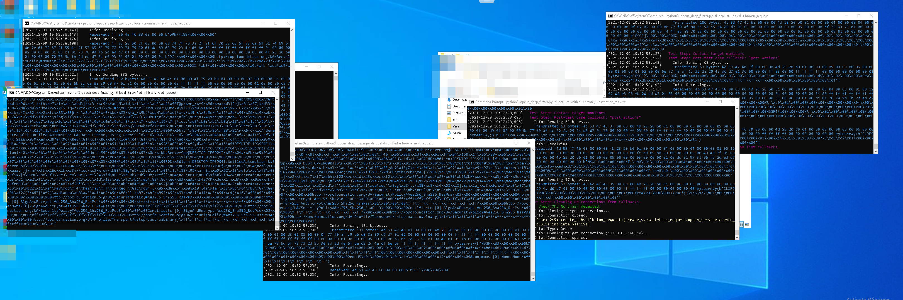

# OPCUA NETWORK FUZZER

We often use fuzzers in our research to find low-hanging bugs in network protocol implementations. Occasionally, we also develop custom fuzzers or harnesses to better go after specific targets. 

This repository contains a network fuzzer that we developed for [Pwn2Own 2022](https://www.zerodayinitiative.com/blog/2022/4/14/pwn2own-miami-2022-results) competition to fuzz OPCUA protocol. The [OPC UA](https://opcfoundation.org/about/opc-technologies/opc-ua/) (Open Platform Communications Unified Architecture) protocol is a standard means of data-exchange between industrial sensors and either on-premises servers or cloud management platforms. 

The fuzzer is based on the [boofuzz](https://github.com/jtpereyda/boofuzz) framework. For more info check out our Claroty Team82 blog [here](https://claroty.com/team82/research/team82-releases-homegrown-opc-ua-network-fuzzer-based-on-boofuzz)




### Usage example
**Install dependencies**
```
python3 -m pip install -r requirements.txt
```
**Run the fuzzer**
```
python3 opcua_fuzzer.py --target_host_ip 10.10.10.10 --target_host_port 4897 --target_app_name softing --request_opcua_to_fuzz browse_request
```

- `target_host_ip` IP of the OPCUA Server
- `target_host_port` PORT which the OPCUA Server Listens to
- `target_app_name` The type of the OPCUA Server to be fuzzed, choose from `kepware`, `dotnetstd`, `softing`, `prosys`, `unified`, `ignition`,`s2opc`
- `request_opcua_to_fuzz` The OPCUA Server request type to fuzz, choose from `read_request`, `browse_request`, `browse_next_request`, `create_subsctibtion_request`, `add_nodes_request`, `history_read_request`

### Results
When the application crashes, the fuzzer will stop because no new connections could be made with the server. The last 1000 sent packets are saved in a `sqlite` database in the `boofuzz-results` directory within this repository. The status of the fuzzer can be monitored here: `http://localhost:26000/`


### Sanity
Sometimes before running the fuzzer you want to ensure that the OPC UA session is correctly created and terminated. To send only one mutation with `\x00` payload above ReadRequest, change `IS_TEST_RUN` variable to `True`

### Supported OPCUA Server types:
- [KEPServerEX](https://www.kepware.com/en-us/products/kepserverex/) (kepware)
- [UA-.NETStandard](https://github.com/OPCFoundation/UA-.NETStandard) (dotnetstd)
- [Softing OPC Server](https://industrial.softing.com/products/opc-opc-ua-software-platform.html) (softing)
- [Prosys OPC UA Simulation Server](https://www.prosysopc.com/products/opc-ua-simulation-server/) (prosys)
- [OPC UA C++ Demo Server](https://www.unified-automation.com/downloads/opc-ua-servers.html) (unified)
- [Ignition's OPC UA Server](https://docs.inductiveautomation.com/display/DOC81/OPC+UA) (ignition)
- [Systerel S2OPC OPC UA Demo Server](https://gitlab.com/systerel/S2OPC)

### Supported request types:
- [Read Service](https://reference.opcfoundation.org/Core/Part4/v105/docs/5.10.2) (read_request): we are fuzzing the nodes to read
- [Browse Service](https://reference.opcfoundation.org/Core/Part4/v105/docs/5.8.2) (browse_request): we are fuzzing the browsed nodes
- [Browse Next Service](https://reference.opcfoundation.org/Core/Part4/v105/docs/5.8.3) (browse_next_request): we are fuzzing the browsed nodes
- [Create Subscription Service](https://reference.opcfoundation.org/Core/Part4/v105/docs/5.13.2) (create_subsctibtion_request): we are fuzzing the entire content
- [Add Nodes Service](https://reference.opcfoundation.org/Core/Part4/v105/docs/5.7.2) (add_nodes_request): we are fuzzing the content that describes the nodes to be added
- [History Read Service](https://reference.opcfoundation.org/v104/Core/docs/Part4/5.10.3/) (history_read_request):  we are fuzzing the number of nodes and the entire content of the read history request

* implementation: `opcua_services.py`

## How To Add Support for additional Server Type:
While the majority of OPC-UA protocol stack implementations will work out-of-the-box with the currently supported servers, users can add new support for other OPC-UA implementations. Please note that as we mainly developed this fuzzer for ourselves, the procedure of adding new support is not very developer-friendly. So what do you need to do to add new OPC-UA implementation:

1. `raw_messages_opcua.py` -  Copy raw packets from Wireshark when a regular client (e.g. [UaExpert](https://www.unified-automation.com/products/development-tools/uaexpert.html)) is connecting to the server. The needed OPC-UA messages are: Hello, Open Channel, Create Session, Activate Session, and Close Session.
2. `raw_messages_opcua.py` - Add support for your server in `get_raw_open_session_messages` and `get_raw_close_session_messages` functions.
3. `opcua_utils.py` - Add your new server type to the following functions: `target_apps`, `get_services_list`, `get_sanity_payload`
4. `opcua_utils.py` - Add hardcoded `ReadRequest` message (copy from Wireshark) for the new server. It will be used for sanity to check the server is functioning.
5. `opcua_utils.py` - Edit `close_session` function by adding your server to `target_app`.
6. `opcua_session.py` - Some servers require specific flow upon session creation. Add the changes to `create_session` function if needed.


## Notes
- For each mutated packet separate OPCUA session is created (HELLO, OPEN CHANNEL, CREATE SESSION etc).
- For most of the OPCUA Servers (.NET excluded) the session is terminated after each mutation.
- To ensure fuzzer stability, validate that the target server is configured to allow many concurrently opened sessions (around ~1000)
- When fuzzing, ensure that the fuzzed service doesn't restart automatically after a crash.


## Dependencies
- [boofuzz](https://github.com/jtpereyda/boofuzz)
- [construct](https://github.com/construct/construct)
